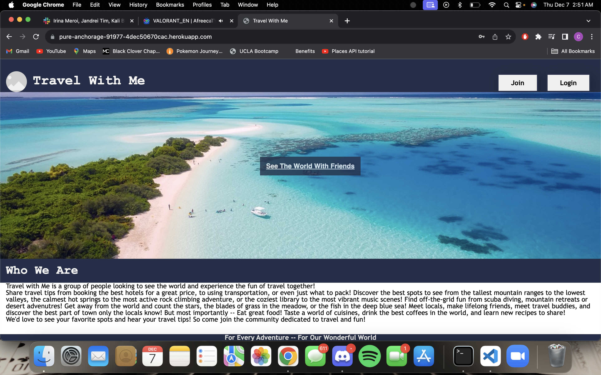

# Travel With Me - a platform for people to connect

## Description

The purpose of this project was to create a social media travel platform for users to engage with each other and share their travel blogs through tips, tricks, photos, and experiences. The motivation for this website was to enhance fullstack development skills in Handlebars, MySQL, API usage, Express, and Sequelize. The project was built to create an application that allows users to create an account that is stored within a database for future login/logout functionality and be able to post content that other users may view. The problem this project solves is demonstrating abilities in building full stack applications allowing multiple users to interact with each other.

## Installation

N/A

## Usage

To use the application, users will note that they are directed to a landing site as posted content will only be visible once a user has joined or logged in. On the landing page, users may choose to either sign up or login using the buttons on the top right corner of the screen. This will prompt a pop-up to the desired form. Upon signing up or logging in, users will be redirected to the website dashboard where they are able to view other user posts, comment/like on posts, or create a post of their own. When a user clicks on the "POST" button, they may fill out a form to submit their post onto the dashboard feed. A title, image upload, description, location, and travel date form will be visible. A small box will be visible at the bottom of the screen. 

## Credits

Megan Meyers and Diarmuid Murphy for continued guidance through the entire project, including (but not limited to) routing issues with Handlebars, usage of Multer middleware for multipart/form data in file uploading user images, and creation of post functionality. Handlebars, MySQL, Express, and Sequelize for middleware used throughout the entire project functionality. 

## Link(s)

https://pure-anchorage-91977-4dec50670cac.herokuapp.com/ (link to deployed application)

https://github.com/ravensandcrows/social_media_platform (link to GitHub repository)

## Image(s)

